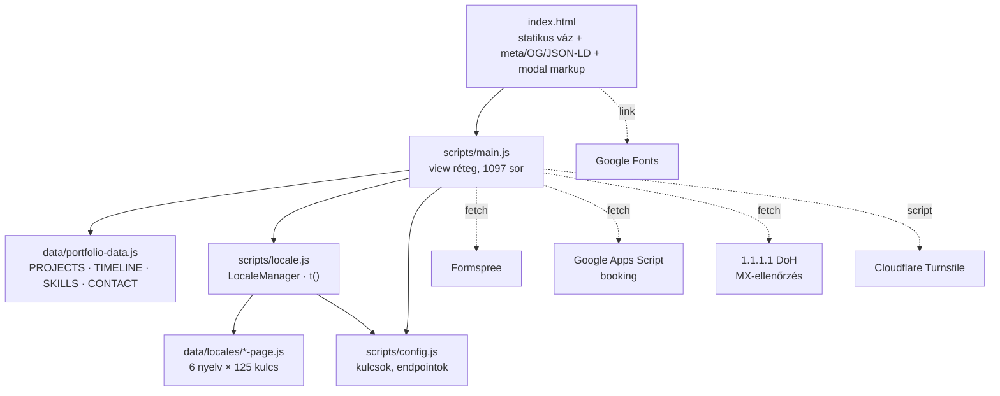

# Architektúrális review — dev-portfilio

**Dátum:** 2026-08-01 · **Commit:** `d93bab8` (master) · **Terjedelem:** ~4 700 sor forrás (HTML/CSS/JS/adat)

---

## 1. Összefoglaló

A projekt egy build-lépés nélküli, adat-vezérelt statikus portfólió. Az alaparchitektúra **jó**: tiszta réteghatár az adat, a lokalizáció és a nézet között, egyetlen igazságforrás a tartalomra, nulla runtime npm-függőség. Ezt a méretet (21 projekt, 6 nyelv) a választott felépítés kényelmesen elbírja, és a "no framework" döntés itt védhető, nem dogma.

Két probléma azonban **ma is élesben hat**: a deploy workflow olyan branch-re van kötve, ami nem létezik (a site sosem frissül automatikusan), és ~95 MB elhagyható PNG backup került a verziókövetésbe, ami minden Pages-artifactbe bekerül. Ezeken túl a fő architektúrális adósság a `scripts/main.js` — 1 097 sor, öt különböző felelősséggel, ~150 sornyi szó szerinti duplikációval a két modal között.

| Terület | Értékelés |
|---|---|
| Réteghatárok, adatmodell | ✅ Erős |
| Lokalizáció | ✅ Erős (125 kulcs, teljes paritás 6 nyelven) |
| Deploy / CI | ✅ Rendezve (lásd K1) |
| Repo-higiénia, asset-súly | ❌ Kritikus (129 MB assets, 119 MB `.git`) |
| Kódszervezés (`main.js`) | ✅ Rendezve (lásd M1/M2) |
| Állapotkezelés | ✅ Rendezve (lásd M3/M4) |
| Akadálymentesség | ⚠️ Részleges (modal fókusz, tab pattern) |
| Tesztelés / minőségi kapuk | ⚠️ Csak szintaxis-ellenőrzés |

---

## 2. Architektúra



**Adatfolyam:** `DOMContentLoaded` → `applyTranslations()` → 5 render-függvény (`renderProjects`, `renderTimeline`, `renderSkills`, `renderContact`, `renderTerminal`) építi fel a DOM-ot template-stringekből. Nyelvváltás ugyanezt az utat futtatja újra. A statisztikák (`computeStats`) az adatból számolódnak, nincsenek beégetve — ez jó döntés.

### Erősségek

- **Egy igazságforrás.** Minden tartalom a `data/portfolio-data.js`-ből jön; a HTML valóban vékony váz. Új projekt hozzáadása egyetlen tömb-elem.
- **Lokalizáció-paritás.** Mind a 6 nyelvi fájl pontosan ugyanazt a 125 kulcsot tartalmazza — ellenőriztem, nulla eltérés. A `t()` EN-fallbackje ([locale.js:62](scripts/locale.js#L62)) plusz védőháló.
- **FOUC-mentes téma.** A pre-paint inline IIFE ([index.html:88-99](index.html#L88-L99)) helyes minta villanás elkerülésére.
- **Statikus SEO/megosztás-réteg.** Canonical, OG, Twitter card, JSON-LD `@graph` (Person + WebSite) — a link-preview akkor is működik, ha a scraper nem futtat JS-t.
- **Átgondolt anti-spam.** Honeypot + minimum kitöltési idő + Turnstile + localStorage cooldown + MX-ellenőrzés. Rétegzett, nem egyetlen pontra épít.
- **Teljesítmény-alapok.** `loading="lazy"`, passzív scroll listener, `IntersectionObserver` + `unobserve` a reveal után, külön `small/` thumbnail és `large/` lightbox-változat.
- **`prefers-reduced-motion`** támogatva ([portfolio.css:1356](styles/portfolio.css#L1356)).

---

## 3. Megállapítások

### 🔴 Kritikus

#### K1 — A deploy workflow soha nem fut le ✅ **elvégezve**

> **Státusz:** a workflow a `master` branchre van kötve, a README lépései és a fejléc-komment is ezt írja. A branch marad `master`.


[.github/workflows/deploy.yml:13](.github/workflows/deploy.yml#L13) a `main` branchre van kötve, a repo default branche viszont `master` (`origin/HEAD -> origin/master`). Automatikus deploy nincs; a site csak kézi `workflow_dispatch`-csel frissül — és a README lépésről lépésre `main`-t ír, tehát a dokumentáció is a nem létező állapotot írja le.

**Javítás:** vagy `branches: [master]`, vagy a branch átnevezése `main`-re (`git branch -m master main` + push + a GitHub default branch átállítása) — utóbbi konzisztensebb a README-vel.

#### K2 — ~95 MB backup PNG a verziókövetésben

| Könyvtár | Méret | Verziókövetve |
|---|---|---|
| `assets/images/projects/large/backup/` | 95 MB | ✅ igen (40 fájl) |
| `assets/images/projects/og/backup/` | 3,2 MB | ✅ igen |
| `assets/images/backup/` | 4,9 MB | `.gitignore`-ban, de tracked fájlokkal |
| **`.git` összesen** | **119 MB** | |

A `.gitignore` csak az `assets/images/backup/` útvonalat zárja ki — a `projects/*/backup/` mappákat nem. A README ezzel szemben azt állítja, hogy a backup mappa git-ignored. Egyes fájlok 5–7,5 MB-osak (`arrganizer_og.png` 7,5 MB), miközben a használt JPEG-változatuk ~650 KB.

Ez nem csak repo-súly: a workflow `path: .`-t tölt fel artifactként ([deploy.yml:48](.github/workflows/deploy.yml#L48)), tehát a 95 MB backup **minden egyes deployban** felmegy a Pages-re.

**Javítás:**
```bash
git rm -r --cached assets/images/projects/large/backup assets/images/projects/og/backup
# .gitignore: assets/images/**/backup/
```
A history-ból való eltávolítás (`git filter-repo`) opcionális, de a `.git` 119 MB-ját ez nélkül nem lehet visszahozni. Ha a Pages-re feltöltendő fájlkör szűkítése a cél, érdemesebb a workflow-ban egy `dist/` mappát összeállítani, mint a teljes repót feltölteni.

---

### 🟠 Magas

#### M1 — `scripts/main.js`: 1 097 sor, öt felelősség ✅ **elvégezve**

> **Státusz:** a szétbontás megtörtént — `main.js` 92 sor (init + wiring), a többi 16 modulban. Az M2 duplikációja is feloldódott a közös `modals/modal.js`, `modals/turnstile.js` és `modals/form-guards.js` modulokban. Az A6 (hiányzó null-check) és A7 (TDZ-kockázat) mellékhatásként megszűnt. A leírás alább az eredeti állapotot dokumentálja.


Egyetlen modul tartalmazza: kategória/ikon metaadatokat, téma-kezelést, a typed-effektet, öt render-függvényt, a hire modal teljes logikáját, a booking modal teljes logikáját (3 lépéses wizard, dátum/slot renderelés, Intl formázás), a lightboxot, az i18n-alkalmazást és a teljes init-wiringot.

A projekt már használ ES modulokat (`config.js`, `locale.js`) — a minta megvan, a `main.js`-t egyszerűen nem bontották fel. Javasolt tagolás:

```
scripts/
  config.js          (meglévő)
  locale.js          (meglévő)
  main.js            → csak init + wiring, ~120 sor
  ui/theme.js        detectTheme, applyTheme, téma-színek
  ui/typed.js        typeLoop
  ui/reveal.js       revealObserver, setupReveal
  render/projects.js projectCard, renderProjects, applyFilter
  render/timeline.js
  render/skills.js
  render/contact.js
  render/terminal.js
  modals/modal.js    közös nyitás/zárás/Escape/fókusz
  modals/turnstile.js
  modals/hire.js
  modals/booking.js
  modals/image.js
```

Nem sürgős hibajavítás, de minden további funkció ára ebben a fájlban nő.

#### M2 — ~150 sor duplikáció a két modal között ✅ **elvégezve** (az M1 bontás részeként)


| Duplikált egység | Hire | Booking |
|---|---|---|
| Turnstile ensure/reset/update | [main.js:350-388](scripts/main.js#L350-L388) | [main.js:591-624](scripts/main.js#L591-L624) |
| Cooldown-ellenőrzés | [main.js:390-393](scripts/main.js#L390-L393) | [main.js:626-629](scripts/main.js#L626-L629) |
| Email-blur MX-ellenőrzés | [main.js:1072-1083](scripts/main.js#L1072-L1083) | [main.js:1084-1095](scripts/main.js#L1084-L1095) |
| Nyitás/zárás + `modal-open` osztály | `openHireModal`/`closeHireModal` | `openBookingModal`/`closeBookingModal` |

Az email-blur handler gyakorlatilag karakterre azonos, csak a szelektorok különböznek. Kiemelendő factory-k: `createTurnstile(containerSel, submitSel)`, `createCooldown(key, ms)`, `attachEmailDomainCheck(inputSel, errSel)`, `createModal({ id, onOpen, onClose })`.

#### M3 — Kettős igazságforrás a nyelvre ✅ **elvégezve**

> **Státusz:** a `state.lang` megszűnt, minden render-modul a `locale.lang`-ot olvassa; a nyelvváltó csak `locale.setLang()`-ot hív.


`state.lang` ([main.js:73-78](scripts/main.js#L73-L78)) és `locale.lang` külön él, kézzel szinkronizálva ([main.js:968-969](scripts/main.js#L968-L969)). A render-függvények a `state.lang`-ot olvassák, a `t()` a `locale`-ét. Ha bárhol csak az egyik frissül, a felirat és a projektleírások különböző nyelven jelennek meg.

**Javítás:** `state.lang` törlése, mindenhol `locale.lang` — a `LocaleManager` már perzisztál és a `documentElement.dataset.lang`-ot is állítja.

#### M4 — A téma-logika három helyen él ✅ **elvégezve**

> **Státusz:** a döntés egy helyen maradt (az `index.html` pre-paint bootstrapje); az `initTheme()` már csak beolvassa az eredményt. A hex-értékek eltűntek a JS-ből: a `theme-color` meta futásidőben a `--bg` custom property-ből frissül, a bootstrap pedig a media-scoped meta tagek közül veszi a feloldott témáét. Így a színek két helyen élnek — a stíluslap `[data-theme]` blokkjaiban és a két meta tagben —, egymást tükrözve.


- inline IIFE ([index.html:88-99](index.html#L88-L99)),
- `detectTheme()` ([main.js:91-95](scripts/main.js#L91-L95)) — ugyanaz a döntés újra, közvetlenül azután, hogy az inline script már eldöntötte,
- `applyTheme()` ([main.js:100-106](scripts/main.js#L100-L106)).

A `#0b0d1a` / `#f6f7fb` hex-pár **négy** helyen szerepel (a két `<meta name="theme-color">` sorral együtt). Egy színérték módosítása ma négy szerkesztés. A `THEME_KEY` duplikációját a kód kommentben jelzi is ([index.html:87](index.html#L87)) — ez helyes, de a megoldás inkább az lenne, hogy az inline script csak a `data-theme` attribútumot állítja, a `theme-color` szinkront pedig a modul végzi egyetlen konstansból.

---

### 🟡 Közepes

#### C1 — Teljes DOM-újraépítés minden nyelvváltásnál

`applyTranslations()` ([main.js:890-894](scripts/main.js#L890-L894)) négy szekció teljes `innerHTML`-jét cseréli. Következmény: a fókusz elveszik, a kártyák újra animálódnak, 21 `` újra a DOM-ba kerül (a böngésző cache-eli, de a layout újraszámol). A `state.tabs` túléli, mert a render onnan olvas — ez jól megoldott. Ekkora oldalon elviselhető, de egy célzott "csak a szövegcsomópontokat cseréld" megközelítés olcsóbb és fókuszbarát lenne.

#### C2 — `innerHTML` vs `textContent` inkonzisztencia a leírásoknál

A kártya-sablon HTML-ként rendereli a leírást ([main.js:203](scripts/main.js#L203)), a tabváltás viszont `textContent`-tel írja felül ([main.js:996](scripts/main.js#L996)). Ma egyik leírás sem tartalmaz `<` vagy `&` karaktert (ellenőriztem: 0 találat), tehát a hiba lappang — de az első `&` a szövegben eltérő megjelenítést fog adni az első renderelés és a tabváltás után. Válassz egy szemantikát; javaslat: escape-elés a sablonban, `textContent` mindenütt.

#### C3 — A tartalom csak kliensoldalon létezik

Az `index.html`-ben egyetlen projektleírás sincs. Az OG/JSON-LD statikus, tehát a link-preview rendben van, de:

- nincs per-nyelv URL (`?lang=de` vagy `/de/`), így nem oszthatók meg a nyelvi változatok, és nincs `hreflang`;
- a JS-t nem futtató crawler üres `Projects` szekciót lát;
- a nyelvválasztás csak `localStorage`, tehát a linkelt oldal mindig a látogató korábbi választását mutatja.

Minimum-lépés: a nyelv olvasása/írása URL-paraméterből a `localStorage` mellett, plusz `hreflang` linkek.

#### C4 — Modal-fókusz: nincs csapda, inkonzisztens visszaadás

Az image modal elmenti a triggert és visszaadja neki a fókuszt ([main.js:846](scripts/main.js#L846), [main.js:863](scripts/main.js#L863)) — helyesen. A hire és booking modal nem: bezárás után a fókusz a `<body>`-ra esik. Egyik modal sem csapdázza a Tabot, tehát billentyűzettel ki lehet lépni a háttérbe egy `aria-modal="true"` dialógusból.

A kártya-tabok is részlegesek: mindkét gomb ugyanarra az `aria-controls`-ra mutat, a panelnek nincs `aria-labelledby`, és nincs nyíl-billentyűs navigáció (a WAI Tabs pattern elvárja).

#### C5 — Nincs teszt, nincs lint; a minőségi kapu duplikált

Az egyetlen ellenőrzés a `node --check` (szintaxis). Ez ráadásul **kétszer, két különböző módon** volt leírva: a `package.json` felsorolta a fájlokat egyenként, a `deploy.yml` glob-olt. Új nyelvi fájl esetén a workflow észrevette, a `npm run check` nem — biztos drift.

> **Részben javítva:** a drift megszűnt — `tools/check-syntax.mjs` bejárja a `scripts/` és `data/` fát, a `npm run check` és a workflow is ezt hívja. Lint és tesztek továbbra sincsenek.

**Hátralévő:** ESLint + Prettier, egy locale-paritás teszt (a 6 fájl kulcshalmaza egyezik-e), egy asset-létezés teszt (minden `image`/`icon` útvonal létezik-e), és egy Playwright smoke-teszt (betöltés, nyelvváltás, szűrő, modal nyitás).

#### C6 — Runtime-függőségek fallback nélkül; adatvédelmi megjegyzés

Öt külső szolgáltatás fut a kliensben: Google Fonts (render-blokkoló `<link>`, [index.html:101](index.html#L101)), Cloudflare Turnstile, Formspree, Google Apps Script, valamint a `1.1.1.1` DoH.

A DoH-hívás ([main.js:395-412](scripts/main.js#L395-L412)) **minden látogató beírt e-mail-domainjét elküldi a Cloudflare-nek**, mielőtt bármit elküldene a form. Technikailag jól van megírva (session-cache, hiba esetén megengedő), és a `CHECK_EMAIL_DOMAIN` flaggel kikapcsolható — de erről nincs tájékoztatás a felületen. Egy rövid mondat a form alatt (vagy a flag kikapcsolása) rendezi.

A `BOOKING_SCRIPT_URL` ([config.js:15](scripts/config.js#L15)) nyílt GET-endpoint; a védelem teljes egészében a GAS oldalán van. Ez rendben van, ha a szerveroldal tényleg verifikálja a Turnstile-tokent és rate-limitel — érdemes ezt a README-ben rögzíteni, hogy a kliensoldali cooldown ne tűnjön biztonsági kontrollnak (nem az, `localStorage`-ból törölhető).

---

### 🟢 Alacsony

| # | Megállapítás | Hely |
|---|---|---|
| A1 | **README-drift:** `data.js`, `locales/*.js`, `style.css` néven hivatkozik a `data/portfolio-data.js`, `data/locales/*-page.js`, `styles/portfolio.css` fájlokra | README.md |
| A2 | A README szerint a `backup/` git-ignored — 40 backup fájl viszont verziókövetett | README.md, .gitignore |
| A3 | ~~A README hero képe `assets/images/projects/cv.jpg`-re mutat, ami nem létezik → törött kép a GitHub-on~~ **javítva** (`projects/large/cv.jpg`) | README.md:7 |
| A4 | Árva fájlok: `github.jpg` a repo gyökerében (verziókövetett, sehol nem hivatkozott), `assets/og.png` (5,8 MB, csak az `og.jpg` van használva) | repo root, assets/ |
| A5 | `export var` a `config.js`-ben, miközben a kódbázis mindenütt `const` | [config.js:5-16](scripts/config.js#L5-L16) |
| A6 | `renderProjects` nem null-ellenőrzi a gridet, a többi render igen | [main.js:211](scripts/main.js#L211) vs. 243, 258, 278 |
| A7 | `revealObserver` a használati helyei **alatt** van deklarálva; ma működik (csak `DOMContentLoaded` után hívódik), de modul-szintű hívásnál TDZ-hiba | [main.js:918](scripts/main.js#L918) |
| A8 | A CSS 1 362 sor egy fájlban — jól szekcionálva, 256 custom property; ha tovább nő, a modal-blokk (943–1296, ~350 sor) külön fájlba kívánkozik | styles/portfolio.css |

---

## 4. Prioritizált akcióterv

**Most (fél óra, élesben ható):**
1. `deploy.yml` branch javítása `master`-re, vagy branch átnevezése `main`-re *(K1)*
2. `.gitignore`: `assets/images/**/backup/` + `git rm -r --cached` a backup mappákra *(K2)*
3. README javítása: fájlnevek, backup-állítás, törött kép *(A1–A3)*
4. `github.jpg` és `assets/og.png` törlése *(A4)*

**Rövid táv (fél nap):**
5. `check` script glob-osítása, a workflow hívja azt *(C5)*
6. `state.lang` megszüntetése, `locale.lang` mindenütt *(M3)*
7. A téma-színek egyetlen forrásba; az inline script minimalizálása *(M4)*
8. Fókusz-csapda + fókusz-visszaadás mindhárom modalban *(C4)*
9. `textContent`/`innerHTML` szemantika egységesítése a leírásoknál *(C2)*

**Közép táv (1–2 nap):**
10. `main.js` felbontása a fenti modul-struktúrára *(M1)*
11. Turnstile / cooldown / modal / email-check factory-k kiemelése *(M2)*
12. Nyelv URL-paraméterben + `hreflang` *(C3)*
13. ESLint + Prettier, locale-paritás és asset-létezés teszt, Playwright smoke *(C5)*
